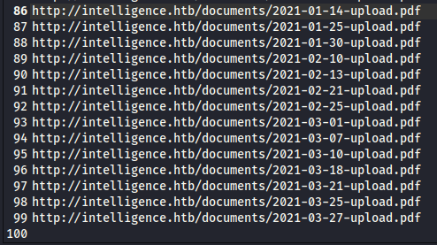
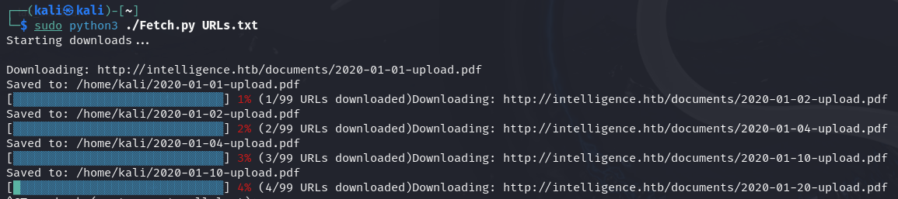

```  
  ___  __  __  ____ _ 
 / _ \|  \/  |/ ___| |
| | | | |\/| | |  _| |
| |_| | |  | | |_| |_|
 \___/|_|  |_|\____(_)
 
  👠˚ʚ♡ɞ˚👛
  𝑻𝒉𝒂𝒕 𝒊𝒔 𝒔𝒐𝒐𝒐 𝒇𝒆𝒕𝒄𝒉!
```

## Step 1:
Have a large list of things to download.



## Usage:
```
sudo python3 ./Fetch.py <filename of URLS>
```


This script will download files to the current working directory; however, it can be changed to suit your liking.
